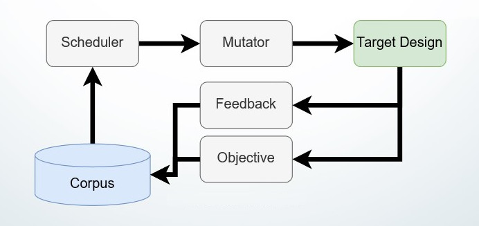
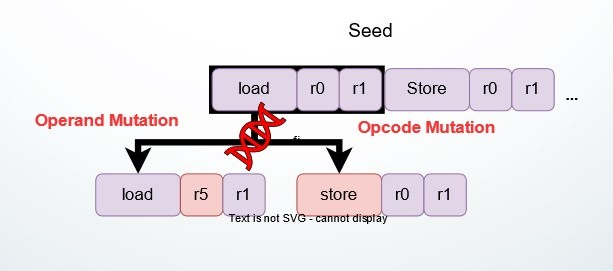

<!--
SPDX-FileCopyrightText: 2022 Intel Corporation

SPDX-License-Identifier: Apache-2.0
-->

# Disclaimer
All components are provided for research and validation purposes only. Use at your own risk.

# Pre-Silicon Hardware Fuzzing Toolkit
From CPU to GPU, and IPU, the complexity of digital hardware design is
increasing rapidly. This makes it more difficult to verify and/or test.
However, detecting bugs before the hardware design is manufactured is a serious
concern. This is because silicon chips often have no upgrade capability, making
bugs persistent. In this repository, we provide building blocks to apply 
advanced software testing techniques to pre-silicon hardware testing.
These blocks are based on LibAFL, a modern framework for building software
fuzzer.

# Supported OS

This tool has only been tested on Linux based OS, and especially Ubuntu 20.04 LTS.

# Dependencies

This framework relies on the VCS simulator to simulate hardware design and
VERDI to extract coverage information. Please, refer to the official
documentation to install the tool. Please, note that some of these tools may
require specific license scheme.

# Installation

This library is mostly designed around the RUST language. 
For this reason, the initial step is to install 'Cargo'. 
This can be easily done with the following command:
```
curl https://sh.rustup.rs -sSf | sh
```

Then, let's clone and build this tool: 
```
git clone https://github.com/IntelLabs/PreSiFuzz PreSiFuzz

cd PreSiFuzz

cargo build
```

# Fuzzing Example

To start playing with the tool, the secworks example is a good candidate.
You can quickly get it running using the following commands:
```
cd secworks-vcs
cargo build
AFL_LAUNCHER_CLIENT=1 ./target/debug/secworks-vcs
```
*Note: AFL_LAUNCHER_CLIENT is an environment variable required to start a unique fuzzer instance.
Starting the fuzzer with this environment variable undefined starts a monitor only.

# Example targets

The target directory contains examples of design to demonstrate the approach.

* [OpenTitan](/doc/opentitan.md)
* [CVA6](/fuzzers/cva6-vcs-fuzzer/README.md)
* [Chipyard with Rocket](/fuzzers/chipyard-vcs-fuzzer/README.md)


# Documentation Components Overview

This documentation describes the various components used in our system, including Observers, Feedback, Mutators, Schedulers, and Stages. Each component plays a critical role in the overall functioning and efficiency of the system. Below is a detailed description of each component:


## Observers

Observers collect information after the execution of test cases by the simulator(s) or emulator(s). The different types of observers available in `libpresifuzz_observers` include:

- **`verdi_xml_observer`**: This observer extracts code coverage information from XML files produced by VCS. The generated bitmap assigns one bit per coverage point, with 0 indicating uncovered and 1 indicating covered points.
- **`trace_observer`**: This observer parses execution trace logs from various tools, including Spike and simulated Rocket cores. The collected information can be used for additional coverage guidance or for identifying trace mismatches (see `differential_feedback`).

## Feedback

Feedback components analyze the extracted information from the observers and return a single boolean signal indicating whether the feedback is interesting or not. Some feedback options include:

- **`verdi_xml_feedback`**: Used for coverage feedback, it tracks any code coverage metrics for VCS. You can also track `assert` coverage and use it as an objective for bug detection.

## Mutators

We have extended LibAFL mutators with RISCV-specific mutators. These mutators can delete, insert, or change opcodes and operands of instructions in a test case. Although their behavior is quite generic, the ISA definition is automatically generated using `riscv-opcodes`. This ISA layer is saved in `libpresifuzz_riscv/cpu_profile.rs`. Use the `parse.py` script to generate a new `cpu_profile` using `riscv-opcodes`.


## Schedulers

We have implemented a naive minimizer scheduler compatible with our `verdi_xml_observers`. This scheduler computes a subset of test cases from the corpus, aiming to maximize coverage.

## Stages

Stages are logical units executed within the fuzzer pipeline. We have extended the LibAFL SyncOnDiskStage to replace the LLMP layer with a simple system-file-based synchronization layer. Since hardware fuzzing has a relatively slow throughput, using system files to synchronize fuzzers is rarely a bottleneck. It also scales easily on servers with NFS available. Fuzzer instances save serialized information into a `sync` directory, which contains observers, test cases, and some statistical information for monitoring. Additionally, we offer a `URGStage` to merge `vdb` reports into system files during fuzzing campaigns, saving disk space over time.

## Event Communication (EC) Library

The EC library is a replacement for LLMP, providing an event manager to handle fired events. It simply saves new test case events into the system file and ignores other events.
